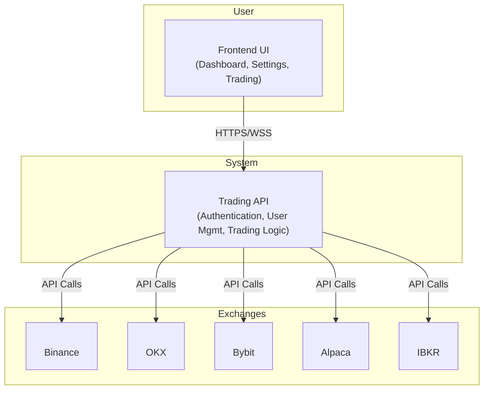
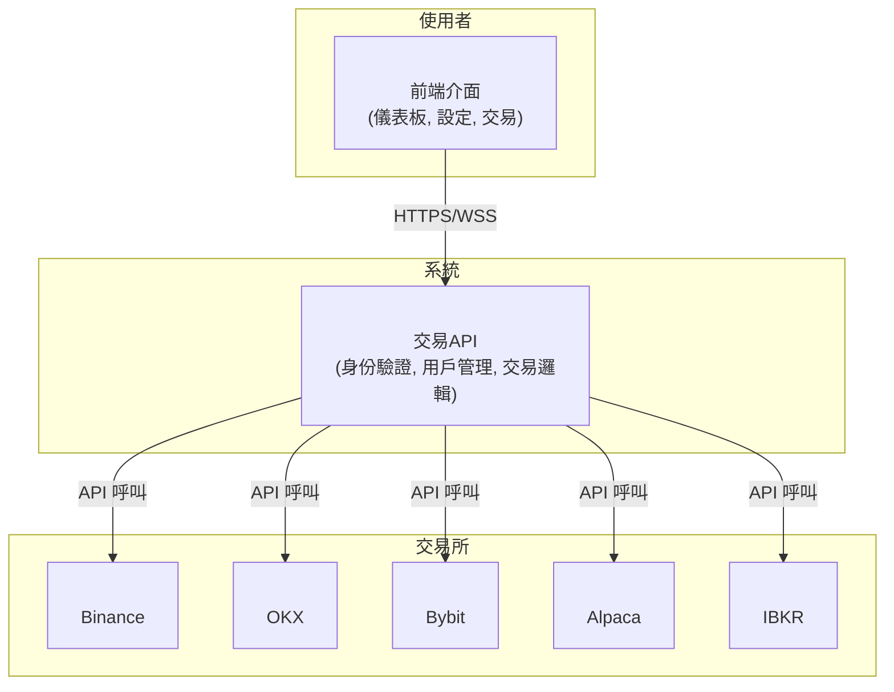

# 🤖 WB Trading Robot API

[](https://choosealicense.com/licenses/mit/)
[](https://www.typescriptlang.org/)
[](https://nodejs.org)
[](https://nestjs.com/)
[](https://www.mongodb.com/)

> **Language / 語言**: [English](#english) | [繁體中文](#繁體中文)

---

## English

A comprehensive multi-exchange trading robot API that integrates with Interactive Brokers (IBKR), Alpaca, and multiple cryptocurrency exchanges through CCXT. This professional-grade trading system provides secure API management, automated trading strategies, and multi-platform support for both traditional and cryptocurrency markets.

### TOC
- [🤖 WB Trading Robot API](#-wb-trading-robot-api)
  - [English](#english)
    - [TOC](#toc)
    - [🚀 Key Features](#-key-features)
    - [🏗 Architecture Overview](#-architecture-overview)
    - [🗂 Project Structure](#-project-structure)
    - [⚙️ Installation \& Setup](#️-installation--setup)
      - [Prerequisites](#prerequisites)
      - [Quick Start](#quick-start)
    - [🔐 Security Features](#-security-features)
      - [API Key Protection](#api-key-protection)
      - [Authentication \& Authorization](#authentication--authorization)
    - [📊 Supported Exchanges](#-supported-exchanges)
      - [Cryptocurrency Exchanges](#cryptocurrency-exchanges)
      - [Traditional Markets](#traditional-markets)
    - [🛠 API Endpoints](#-api-endpoints)
      - [Authentication](#authentication)
      - [User Management](#user-management)
      - [Trading Operations](#trading-operations)
      - [Market Data](#market-data)
    - [📋 API Documentation](#-api-documentation)
      - [Response Format](#response-format)
      - [Error Handling](#error-handling)
    - [🧪 Testing](#-testing)
    - [🚀 Deployment](#-deployment)
      - [Docker Deployment](#docker-deployment)
      - [Production Checklist](#production-checklist)
    - [⚠️ Important Security Warnings](#️-important-security-warnings)
    - [📈 Trading Strategies](#-trading-strategies)
      - [Built-in Strategies](#built-in-strategies)
      - [Custom Strategy Development](#custom-strategy-development)
    - [📊 Monitoring \& Analytics](#-monitoring--analytics)
    - [🔧 Configuration](#-configuration)
      - [Trading Parameters](#trading-parameters)
    - [📜 License](#-license)
    - [⚠️ Disclaimer](#️-disclaimer)
    - [🤝 Contributing](#-contributing)
    - [📞 Support](#-support)
  - [繁體中文](#繁體中文)
    - [TOC](#toc-1)
    - [🚀 主要功能](#-主要功能)
    - [🏗 架構概覽](#-架構概覽)
    - [🗂 專案結構](#-專案結構)
    - [⚙️ 安裝與設定](#️-安裝與設定)
      - [前置要求](#前置要求)
      - [快速開始](#快速開始)
    - [🔐 安全功能](#-安全功能)
      - [API金鑰保護](#api金鑰保護)
      - [身份驗證與授權](#身份驗證與授權)
    - [📊 支援的交易所](#-支援的交易所)
      - [加密貨幣交易所](#加密貨幣交易所)
      - [傳統市場](#傳統市場)
    - [🛠 API端點](#-api端點)
      - [身份驗證](#身份驗證)
      - [用戶管理](#用戶管理)
      - [交易操作](#交易操作)
      - [市場數據](#市場數據)
    - [📋 API文檔](#-api文檔)
      - [回應格式](#回應格式)
      - [錯誤處理](#錯誤處理)
    - [🧪 測試](#-測試)
    - [🚀 部署](#-部署)
      - [Docker部署](#docker部署)
      - [生產環境檢查清單](#生產環境檢查清單)
    - [⚠️ 重要安全警告](#️-重要安全警告)
    - [📈 交易策略](#-交易策略)
      - [內建策略](#內建策略)
      - [自訂策略開發](#自訂策略開發)
    - [📊 監控與分析](#-監控與分析)
    - [🔧 配置](#-配置)
      - [交易參數](#交易參數)
    - [📜 授權條款](#-授權條款)
    - [⚠️ 免責聲明](#️-免責聲明)
    - [🤝 貢獻方式](#-貢獻方式)
    - [📞 支援](#-支援)

### 🚀 Key Features

- **Multi-Exchange Support** - Binance, OKX, Bybit, Alpaca (Paper & Live Trading)
- **Interactive Brokers Integration** - Professional stock and options trading
- **Secure API Management** - Encrypted storage with JWT authentication
- **User Settings Management** - Personalized trading configurations
- **Advanced Security** - 2FA support, rate limiting, and request validation
- **Real-time Trading** - Live market data and order execution
- **Paper Trading** - Risk-free strategy testing environment
- **RESTful API** - Complete API documentation with Swagger UI

### 🏗 Architecture Overview



### 🗂 Project Structure

```bash
WB-IBKR-Alpaca-CCXT-API-Public/
├── src/
│   ├── auth/                # Authentication & JWT management
│   ├── mongodb/             # Database models and schemas
│   ├── user-settings/       # User configuration management
│   ├── trading/             # Core trading logic
│   │   ├── strategies/      # Trading strategies
│   │   ├── exchanges/       # Exchange integrations
│   │   └── risk-mgmt/       # Risk management
│   └── common/              # Shared utilities and interfaces
├── config/                  # Configuration files
├── docs/                    # API documentation
├── tests/                   # Unit and integration tests
├── .env.example            # Environment variables template
├── package.json            # Node.js dependencies
└── docker-compose.yml      # Docker configuration
```

### ⚙️ Installation & Setup

#### Prerequisites

- **Node.js** v16 or higher
- **MongoDB** (local or cloud)
- **Trading Accounts**: IBKR, Alpaca, and/or crypto exchange accounts
- **API Keys** from supported exchanges

#### Quick Start

1. **Clone the repository**
   ```bash
   git clone https://github.com/catowabisabi/WB-IBKR-Alpaca-CCXT-API-Public.git
   cd WB-IBKR-Alpaca-CCXT-API-Public
   ```

2. **Install dependencies**
   ```bash
   npm install
   # or
   yarn install
   ```

3. **Environment configuration**
   ```bash
   cp .env.example .env
   ```

4. **Configure environment variables**
   ```bash
   # Server Configuration
   PORT=3000
   NODE_ENV=development
   
   # MongoDB Configuration
   MONGODB_URI=mongodb://localhost:27017/trading-bot
   
   # JWT Configuration
   JWT_SECRET=your-secure-secret-key
   JWT_EXPIRATION=24h
   
   # Rate Limiting
   RATE_LIMIT_WINDOW=15
   RATE_LIMIT_MAX=100
   
   # Exchange API Keys (encrypted storage)
   # BINANCE_API_KEY=your_binance_key
   # ALPACA_API_KEY=your_alpaca_key
   # IBKR_CLIENT_ID=your_ibkr_client_id
   ```

5. **Start the application**
   ```bash
   # Development mode
   npm run start:dev
   
   # Production mode
   npm run start:prod
   ```

### 🔐 Security Features

#### API Key Protection
- **Encrypted Storage** - All API keys encrypted before database storage
- **Access Control** - Keys accessible only to authenticated users
- **Secure Transmission** - HTTPS enforcement for all communications
- **Key Rotation** - Regular API key rotation recommendations

#### Authentication & Authorization
- **JWT-based Authentication** - Stateless token-based security
- **Rate Limiting** - Protection against API abuse
- **Request Validation** - Input sanitization and validation
- **CORS Protection** - Cross-origin resource sharing controls
- **2FA Support** - Two-factor authentication integration

### 📊 Supported Exchanges

#### Cryptocurrency Exchanges
| Exchange | Features | Status |
|----------|----------|--------|
| **Binance** | Spot, Futures, Options | ✅ Active |
| **OKX** | Spot, Perpetual, Options | ✅ Active |
| **Bybit** | Spot, USDT Perpetual | ✅ Active |

#### Traditional Markets
| Platform | Features | Status |
|----------|----------|--------|
| **Alpaca** | US Stocks, Paper Trading | ✅ Active |
| **Interactive Brokers** | Global Markets, Options | ✅ Active |

### 🛠 API Endpoints

#### Authentication
```http
POST /auth/login          # User authentication
POST /auth/register       # User registration
POST /auth/refresh        # Token refresh
POST /auth/logout         # User logout
```

#### User Management
```http
GET    /user-settings/mysettings    # Get user settings
PATCH  /user-settings/keys          # Update API keys
PUT    /user-settings/preferences   # Update preferences
DELETE /user-settings/keys/:exchange # Remove API keys
```

#### Trading Operations
```http
GET    /trading/status              # Get trading status
POST   /trading/orders              # Place orders
GET    /trading/orders/:id          # Get order details
DELETE /trading/orders/:id          # Cancel orders
GET    /trading/positions           # Get positions
GET    /trading/portfolio           # Portfolio overview
```

#### Market Data
```http
GET /market/prices/:symbol          # Real-time prices
GET /market/orderbook/:symbol       # Order book data
GET /market/trades/:symbol          # Recent trades
GET /market/klines/:symbol          # Candlestick data
```

### 📋 API Documentation

Interactive API documentation is available at `/api` when running the server (Swagger UI).

#### Response Format
```json
{
  "success": true,
  "data": {
    // Response data
  },
  "timestamp": "2024-01-15T10:30:00Z",
  "requestId": "uuid-request-id"
}
```

#### Error Handling
```json
{
  "success": false,
  "error": {
    "code": "INVALID_API_KEY",
    "message": "Invalid or expired API key",
    "details": {}
  },
  "timestamp": "2024-01-15T10:30:00Z"
}
```

### 🧪 Testing

```bash
# Unit tests
npm run test

# Integration tests
npm run test:e2e

# Test coverage
npm run test:cov

# Specific test files
npm run test -- --testPathPattern=trading
```

### 🚀 Deployment

#### Docker Deployment
```bash
# Build and run with Docker Compose
docker-compose up -d

# Scale services
docker-compose up -d --scale api=3
```

#### Production Checklist
- [ ] Environment variables configured
- [ ] API keys properly encrypted
- [ ] SSL/TLS certificates installed
- [ ] Database backups configured
- [ ] Monitoring and logging setup
- [ ] Rate limiting configured
- [ ] CORS policies set

### ⚠️ Important Security Warnings

- **Never commit API keys** - Use environment variables only
- **Enable 2FA** - On all connected trading accounts  
- **Regular key rotation** - Update API keys periodically
- **Monitor access logs** - Watch for unusual activity
- **Use paper trading** - Test strategies before live trading

### 📈 Trading Strategies

#### Built-in Strategies
- **Grid Trading** - Automated buy/sell grid orders
- **DCA (Dollar Cost Averaging)** - Systematic investment approach
- **Momentum Trading** - Trend-following algorithms
- **Arbitrage** - Cross-exchange price differences
- **Market Making** - Providing liquidity for spreads

#### Custom Strategy Development
```javascript
class CustomStrategy extends BaseStrategy {
  async execute(marketData) {
    // Your strategy logic here
    const signal = this.analyzeMarket(marketData);
    
    if (signal.action === 'BUY') {
      return await this.placeBuyOrder(signal);
    }
  }
}
```

### 📊 Monitoring & Analytics

- **Real-time Dashboard** - Live trading metrics
- **Performance Analytics** - P&L tracking and reporting
- **Risk Metrics** - Position sizing and exposure analysis
- **Trade History** - Complete transaction logs
- **Alert System** - Custom notifications and warnings

### 🔧 Configuration

#### Trading Parameters
```json
{
  "riskManagement": {
    "maxPositionSize": 0.05,
    "stopLossPercentage": 2.0,
    "takeProfitPercentage": 3.0,
    "maxDailyLoss": 100
  },
  "tradingHours": {
    "start": "09:30",
    "end": "16:00",
    "timezone": "EST"
  }
}
```

### 📜 License

This project is licensed under the MIT License - see the [LICENSE](LICENSE) file for details.

### ⚠️ Disclaimer

**This software is for educational purposes only. Use at your own risk. The developers are not responsible for any financial losses incurred through the use of this software.**

### 🤝 Contributing

1. Fork the repository
2. Create your feature branch (`git checkout -b feature/amazing-feature`)
3. Commit your changes (`git commit -m 'Add amazing feature'`)
4. Push to the branch (`git push origin feature/amazing-feature`)
5. Create a Pull Request

### 📞 Support

For support, please:
- Check the [documentation](docs/)
- Search [existing issues](https://github.com/catowabisabi/WB-IBKR-Alpaca-CCXT-API-Public/issues)
- Create a [new issue](https://github.com/catowabisabi/WB-IBKR-Alpaca-CCXT-API-Public/issues/new) if needed

**Remember: Never share sensitive information when requesting support.**

---

## 繁體中文

一個全面的多交易所交易機器人API，整合Interactive Brokers (IBKR)、Alpaca以及多個透過CCXT的加密貨幣交易所。這個專業級交易系統提供安全的API管理、自動化交易策略，以及傳統和加密貨幣市場的多平台支援。

### TOC
- [🤖 WB Trading Robot API](#-wb-trading-robot-api)
  - [English](#english)
    - [TOC](#toc)
    - [🚀 Key Features](#-key-features)
    - [🏗 Architecture Overview](#-architecture-overview)
    - [🗂 Project Structure](#-project-structure)
    - [⚙️ Installation \& Setup](#️-installation--setup)
      - [Prerequisites](#prerequisites)
      - [Quick Start](#quick-start)
    - [🔐 Security Features](#-security-features)
      - [API Key Protection](#api-key-protection)
      - [Authentication \& Authorization](#authentication--authorization)
    - [📊 Supported Exchanges](#-supported-exchanges)
      - [Cryptocurrency Exchanges](#cryptocurrency-exchanges)
      - [Traditional Markets](#traditional-markets)
    - [🛠 API Endpoints](#-api-endpoints)
      - [Authentication](#authentication)
      - [User Management](#user-management)
      - [Trading Operations](#trading-operations)
      - [Market Data](#market-data)
    - [📋 API Documentation](#-api-documentation)
      - [Response Format](#response-format)
      - [Error Handling](#error-handling)
    - [🧪 Testing](#-testing)
    - [🚀 Deployment](#-deployment)
      - [Docker Deployment](#docker-deployment)
      - [Production Checklist](#production-checklist)
    - [⚠️ Important Security Warnings](#️-important-security-warnings)
    - [📈 Trading Strategies](#-trading-strategies)
      - [Built-in Strategies](#built-in-strategies)
      - [Custom Strategy Development](#custom-strategy-development)
    - [📊 Monitoring \& Analytics](#-monitoring--analytics)
    - [🔧 Configuration](#-configuration)
      - [Trading Parameters](#trading-parameters)
    - [📜 License](#-license)
    - [⚠️ Disclaimer](#️-disclaimer)
    - [🤝 Contributing](#-contributing)
    - [📞 Support](#-support)
  - [繁體中文](#繁體中文)
    - [TOC](#toc-1)
    - [🚀 主要功能](#-主要功能)
    - [🏗 架構概覽](#-架構概覽)
    - [🗂 專案結構](#-專案結構)
    - [⚙️ 安裝與設定](#️-安裝與設定)
      - [前置要求](#前置要求)
      - [快速開始](#快速開始)
    - [🔐 安全功能](#-安全功能)
      - [API金鑰保護](#api金鑰保護)
      - [身份驗證與授權](#身份驗證與授權)
    - [📊 支援的交易所](#-支援的交易所)
      - [加密貨幣交易所](#加密貨幣交易所)
      - [傳統市場](#傳統市場)
    - [🛠 API端點](#-api端點)
      - [身份驗證](#身份驗證)
      - [用戶管理](#用戶管理)
      - [交易操作](#交易操作)
      - [市場數據](#市場數據)
    - [📋 API文檔](#-api文檔)
      - [回應格式](#回應格式)
      - [錯誤處理](#錯誤處理)
    - [🧪 測試](#-測試)
    - [🚀 部署](#-部署)
      - [Docker部署](#docker部署)
      - [生產環境檢查清單](#生產環境檢查清單)
    - [⚠️ 重要安全警告](#️-重要安全警告)
    - [📈 交易策略](#-交易策略)
      - [內建策略](#內建策略)
      - [自訂策略開發](#自訂策略開發)
    - [📊 監控與分析](#-監控與分析)
    - [🔧 配置](#-配置)
      - [交易參數](#交易參數)
    - [📜 授權條款](#-授權條款)
    - [⚠️ 免責聲明](#️-免責聲明)
    - [🤝 貢獻方式](#-貢獻方式)
    - [📞 支援](#-支援)

### 🚀 主要功能

- **多交易所支援** - Binance、OKX、Bybit、Alpaca（模擬與實盤交易）
- **Interactive Brokers整合** - 專業股票和選擇權交易
- **安全API管理** - 加密存儲與JWT身份驗證
- **用戶設定管理** - 個人化交易配置
- **進階安全性** - 2FA支援、速率限制和請求驗證
- **即時交易** - 即時市場數據和訂單執行
- **模擬交易** - 無風險策略測試環境
- **RESTful API** - 完整API文檔與Swagger UI

### 🏗 架構概覽



### 🗂 專案結構

```bash
WB-IBKR-Alpaca-CCXT-API-Public/
├── src/
│   ├── auth/                # 身份驗證與JWT管理
│   ├── mongodb/             # 資料庫模型和架構
│   ├── user-settings/       # 用戶配置管理
│   ├── trading/             # 核心交易邏輯
│   │   ├── strategies/      # 交易策略
│   │   ├── exchanges/       # 交易所整合
│   │   └── risk-mgmt/       # 風險管理
│   └── common/              # 共用工具和介面
├── config/                  # 配置文件
├── docs/                    # API文檔
├── tests/                   # 單元和整合測試
├── .env.example            # 環境變數範本
├── package.json            # Node.js依賴套件
└── docker-compose.yml      # Docker配置
```

### ⚙️ 安裝與設定

#### 前置要求

- **Node.js** v16或更高版本
- **MongoDB**（本地或雲端）
- **交易帳戶**：IBKR、Alpaca和/或加密貨幣交易所帳戶
- 支援交易所的**API金鑰**

#### 快速開始

1. **複製儲存庫**
   ```bash
   git clone https://github.com/catowabisabi/WB-IBKR-Alpaca-CCXT-API-Public.git
   cd WB-IBKR-Alpaca-CCXT-API-Public
   ```

2. **安裝依賴套件**
   ```bash
   npm install
   # 或
   yarn install
   ```

3. **環境配置**
   ```bash
   cp .env.example .env
   ```

4. **配置環境變數**
   ```bash
   # 伺服器配置
   PORT=3000
   NODE_ENV=development
   
   # MongoDB配置
   MONGODB_URI=mongodb://localhost:27017/trading-bot
   
   # JWT配置
   JWT_SECRET=您的安全密鑰
   JWT_EXPIRATION=24h
   
   # 速率限制
   RATE_LIMIT_WINDOW=15
   RATE_LIMIT_MAX=100
   
   # 交易所API金鑰（加密存儲）
   # BINANCE_API_KEY=您的_binance_金鑰
   # ALPACA_API_KEY=您的_alpaca_金鑰
   # IBKR_CLIENT_ID=您的_ibkr_客戶端ID
   ```

5. **啟動應用程式**
   ```bash
   # 開發模式
   npm run start:dev
   
   # 生產模式
   npm run start:prod
   ```

### 🔐 安全功能

#### API金鑰保護
- **加密存儲** - 所有API金鑰在資料庫存儲前加密
- **存取控制** - 金鑰僅限已驗證用戶存取
- **安全傳輸** - 所有通訊強制使用HTTPS
- **金鑰輪替** - 建議定期輪替API金鑰

#### 身份驗證與授權
- **JWT身份驗證** - 無狀態令牌安全機制
- **速率限制** - 防護API濫用
- **請求驗證** - 輸入清理和驗證
- **CORS保護** - 跨域資源共享控制
- **2FA支援** - 雙重驗證整合

### 📊 支援的交易所

#### 加密貨幣交易所
| 交易所 | 功能 | 狀態 |
|--------|------|------|
| **Binance** | 現貨、期貨、選擇權 | ✅ 活躍 |
| **OKX** | 現貨、永續合約、選擇權 | ✅ 活躍 |
| **Bybit** | 現貨、USDT永續 | ✅ 活躍 |

#### 傳統市場
| 平台 | 功能 | 狀態 |
|------|------|------|
| **Alpaca** | 美股、模擬交易 | ✅ 活躍 |
| **Interactive Brokers** | 全球市場、選擇權 | ✅ 活躍 |

### 🛠 API端點

#### 身份驗證
```http
POST /auth/login          # 用戶身份驗證
POST /auth/register       # 用戶註冊
POST /auth/refresh        # 令牌刷新
POST /auth/logout         # 用戶登出
```

#### 用戶管理
```http
GET    /user-settings/mysettings    # 獲取用戶設定
PATCH  /user-settings/keys          # 更新API金鑰
PUT    /user-settings/preferences   # 更新偏好設定
DELETE /user-settings/keys/:exchange # 移除API金鑰
```

#### 交易操作
```http
GET    /trading/status              # 獲取交易狀態
POST   /trading/orders              # 下單
GET    /trading/orders/:id          # 獲取訂單詳情
DELETE /trading/orders/:id          # 取消訂單
GET    /trading/positions           # 獲取持倉
GET    /trading/portfolio           # 投資組合概覽
```

#### 市場數據
```http
GET /market/prices/:symbol          # 即時價格
GET /market/orderbook/:symbol       # 訂單簿數據
GET /market/trades/:symbol          # 最近成交
GET /market/klines/:symbol          # K線數據
```

### 📋 API文檔

當伺服器運行時，可在`/api`查看互動式API文檔（Swagger UI）。

#### 回應格式
```json
{
  "success": true,
  "data": {
    // 回應數據
  },
  "timestamp": "2024-01-15T10:30:00Z",
  "requestId": "uuid-request-id"
}
```

#### 錯誤處理
```json
{
  "success": false,
  "error": {
    "code": "INVALID_API_KEY",
    "message": "無效或過期的API金鑰",
    "details": {}
  },
  "timestamp": "2024-01-15T10:30:00Z"
}
```

### 🧪 測試

```bash
# 單元測試
npm run test

# 整合測試
npm run test:e2e

# 測試覆蓋率
npm run test:cov

# 特定測試文件
npm run test -- --testPathPattern=trading
```

### 🚀 部署

#### Docker部署
```bash
# 使用Docker Compose建構和運行
docker-compose up -d

# 擴展服務
docker-compose up -d --scale api=3
```

#### 生產環境檢查清單
- [ ] 環境變數已配置
- [ ] API金鑰已正確加密
- [ ] SSL/TLS憑證已安裝
- [ ] 資料庫備份已配置
- [ ] 監控和日log紀錄已設定
- [ ] 速率限制已配置
- [ ] CORS政策已設定

### ⚠️ 重要安全警告

- **永不提交API金鑰** - 僅使用環境變數
- **啟用2FA** - 在所有連接的交易帳戶上
- **定期金鑰輪替** - 定期更新API金鑰
- **監控存取日誌** - 注意異常活動
- **使用模擬交易** - 在實盤交易前測試策略

### 📈 交易策略

#### 內建策略
- **網格交易** - 自動化買賣網格訂單
- **定投策略（DCA）** - 系統性投資方法
- **動量交易** - 趨勢跟隨演算法
- **套利交易** - 跨交易所價差
- **做市策略** - 提供流動性賺取價差

#### 自訂策略開發
```javascript
class CustomStrategy extends BaseStrategy {
  async execute(marketData) {
    // 您的策略邏輯
    const signal = this.analyzeMarket(marketData);
    
    if (signal.action === 'BUY') {
      return await this.placeBuyOrder(signal);
    }
  }
}
```

### 📊 監控與分析

- **即時儀表板** - 即時交易指標
- **績效分析** - 損益追蹤和報告
- **風險指標** - 倉位大小和曝險分析
- **交易歷史** - 完整交易記錄
- **警報系統** - 自訂通知和警告

### 🔧 配置

#### 交易參數
```json
{
  "riskManagement": {
    "maxPositionSize": 0.05,
    "stopLossPercentage": 2.0,
    "takeProfitPercentage": 3.0,
    "maxDailyLoss": 100
  },
  "tradingHours": {
    "start": "09:30",
    "end": "16:00",
    "timezone": "EST"
  }
}
```

### 📜 授權條款

本專案使用MIT授權條款 - 詳見[LICENSE](LICENSE)文件。

### ⚠️ 免責聲明

**此軟體僅供教育目的使用。使用風險自負。開發者不對使用此軟體造成的任何經濟損失負責。**

### 🤝 貢獻方式

1. Fork此儲存庫
2. 建立功能分支（`git checkout -b feature/amazing-feature`）
3. 提交您的變更（`git commit -m 'Add amazing feature'`）
4. 推送到分支（`git push origin feature/amazing-feature`）
5. 建立Pull Request

### 📞 支援

如需支援，請：
- 查看[文檔](docs/)
- 搜尋[現有問題](https://github.com/catowabisabi/WB-IBKR-Alpaca-CCXT-API-Public/issues)
- 如有需要，建立[新問題](https://github.com/catowabisabi/WB-IBKR-Alpaca-CCXT-API-Public/issues/new)

**請記住：請求支援時切勿分享敏感資訊。**

---

[⬆️ Back to top / 回到頂部](#-wb-trading-robot-api)
